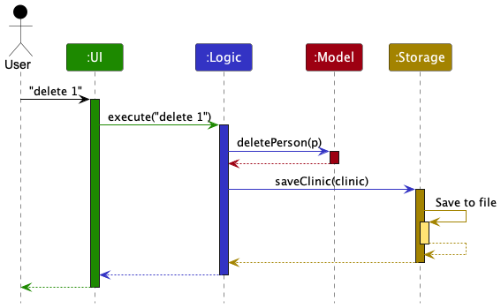
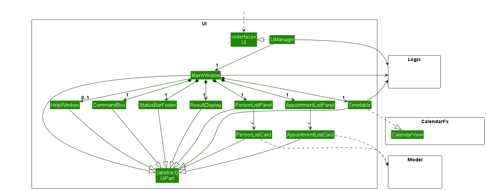
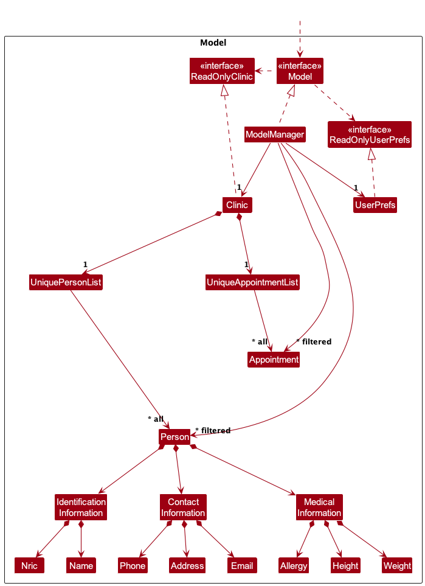
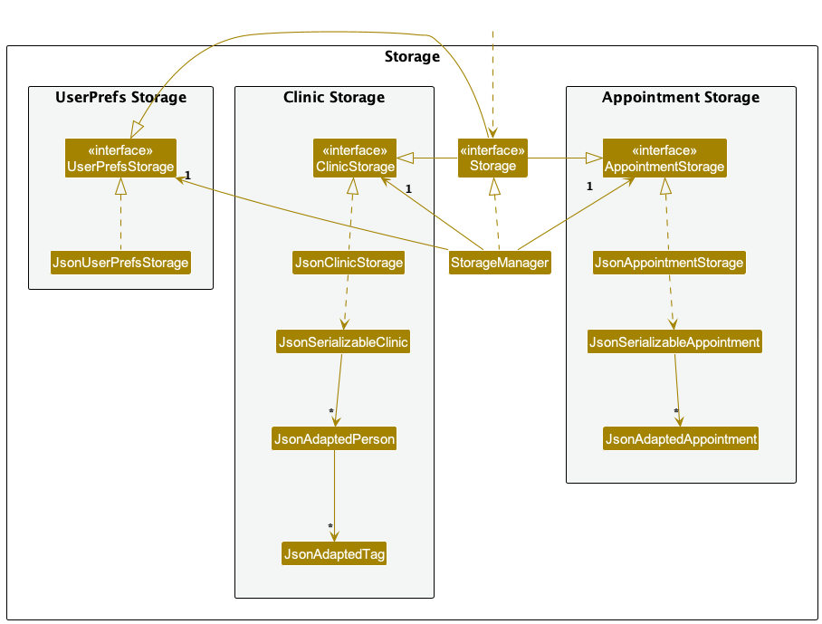

## TOC

* Table of Contents
{:toc}

--------------------------------------------------------------------------------------------------------------------

## Acknowledgements

* Used singleton pattern from [wikipedia](https://en.wikipedia.org/wiki/Initialization-on-demand_holder_idiom)
* Used formula for NRIC validation from [here](https://github.com/samliew/singapore-nric/tree/main)
* Libraries used: [JavaFX](https://openjfx.io/), [Jackson](https://github.com/FasterXML/jackson), [JUnit5](https://github.com/junit-team/junit5), [CalendarFx](https://github.com/dlsc-software-consulting-gmbh/CalendarFX)
* This project is based on the AddressBook-Level3 project created by the [SE-EDU initiative](https://se-education.org).

[Back to table of contents](#toc)

--------------------------------------------------------------------------------------------------------------------

## Setting up and getting started

Refer to the guide [_Setting up and getting started_](SettingUp.md).

[Back to table of contents](#toc)

--------------------------------------------------------------------------------------------------------------------

## Design

:bulb: **Tip:** The `.puml` files used to create diagrams in this document `docs/diagrams` folder. Refer to the [_PlantUML Tutorial_ at se-edu/guides](https://se-education.org/guides/tutorials/plantUml.html) to learn how to create and edit diagrams.

[Back to table of contents](#toc)

### Architecture

The ***Architecture Diagram*** given above explains the high-level design of the App.

Below is a quick overview of the main components and how they interact with each other.

**Main components of the architecture**

**`Main`** (consisting of classes [`Main`](https://github.com/AY2324S2-CS2103T-W08-2/tp/tree/master/src/main/java/vitalconnect/Main.java) and [`MainApp`](https://github.com/AY2324S2-CS2103T-W08-2/tp/blob/master/src/main/java/vitalconnect/MainApp.java)) is in charge of the app launch and shutdown.
* At app launch, it initializes the other components in the correct sequence, and connects them up with each other.
* At shut down, it shuts down the other components and invokes cleanup methods where necessary.

The bulk of the app's work is done by the following four components:

* [**`UI`**](#ui-component): The UI of the App.
* [**`Logic`**](#logic-component): The command executor.
* [**`Model`**](#model-component): Holds the data of the App in memory.
* [**`Storage`**](#storage-component): Reads data from, and writes data to, the hard disk.

[**`Commons`**](#common-classes) represents a collection of classes used by multiple other components.

**How the architecture components interact with each other**

The *Sequence Diagram* below shows how the components interact with each other for the scenario where the user issues the command `delete 1`.

Each of the four main components (also shown in the diagram above),

* defines its *API* in an `interface` with the same name as the Component.
* implements its functionality using a concrete `{Component Name}Manager` class (which follows the corresponding API `interface` mentioned in the previous point.

For example, the `Logic` component defines its API in the `Logic.java` interface and implements its functionality using the `LogicManager.java` class which follows the `Logic` interface. Other components interact with a given component through its interface rather than the concrete class (reason: to prevent outside components from being coupled to the implementation of a component), as illustrated in the (partial) class diagram below.

The sections below give more details of each component.

[Back to table of contents](#toc)

### UI component

The **API** of this component is specified in [`Ui.java`](https://github.com/AY2324S2-CS2103T-W08-2/tp/tree/master/src/main/java/vitalconnect/ui/Ui.java)

The UI consists of a `MainWindow` that is made up of parts e.g.`CommandBox`, `ResultDisplay`, `PersonListPanel`, `StatusBarFooter` etc. All these, including the `MainWindow`, inherit from the abstract `UiPart` class which captures the commonalities between classes that represent parts of the visible GUI.

The `UI` component uses the JavaFx UI framework. The layouts of these UI parts are defined in matching `.fxml` files that are in the `src/main/resources/view` folder. For example, the layout of the [`MainWindow`](https://github.com/AY2324S2-CS2103T-W08-2/tp/tree/master/src/main/java/vitalconnect/ui/MainWindow.java) is specified in [`MainWindow.fxml`](https://github.com/AY2324S2-CS2103T-W08-2/tp/tree/master/src/main/resources/view/MainWindow.fxml)

The `UI` component,

* executes user commands using the `Logic` component.
* listens for changes to `Model` data so that the UI can be updated with the modified data.
* keeps a reference to the `Logic` component, because the `UI` relies on the `Logic` to execute commands.
* depends on some classes in the `Model` component, as it displays `Person` object residing in the `Model`.

[Back to table of contents](#toc)

### Logic component

**API** : [`Logic.java`](https://github.com/AY2324S2-CS2103T-W08-2/tp/tree/master/src/main/java/vitalconnect/logic/Logic.java)

Here's a (partial) class diagram of the `Logic` component:

The sequence diagram below illustrates the interactions within the `Logic` component, taking `execute("delete 1")` API call as an example.

:information_source: **Note:** The lifeline for `DeleteCommandParser` should end at the destroy marker (X) but due to a limitation of PlantUML, the lifeline continues till the end of the diagram.

How the `Logic` component works:

1. When `Logic` is called upon to execute a command, it is passed to an `ClinicParser` object which in turn creates a parser that matches the command (e.g., `DeleteCommandParser`) and uses it to parse the command.
1. This results in a `Command` object (more precisely, an object of one of its subclasses e.g., `DeleteCommand`) which is executed by the `LogicManager`.
1. The command can communicate with the `Model` when it is executed (e.g. to delete a person). 
   Note that although this is shown as a single step in the diagram above (for simplicity), in the code it can take several interactions (between the command object and the `Model`) to achieve.
1. The result of the command execution is encapsulated as a `CommandResult` object which is returned back from `Logic`.

Here are the other classes in `Logic` (omitted from the class diagram above) that are used for parsing a user command:

How the parsing works:
* When called upon to parse a user command, the `ClinicParser` class creates an `XYZCommandParser` (`XYZ` is a placeholder for the specific command name e.g., `AddCommandParser`) which uses the other classes shown above to parse the user command and create a `XYZCommand` object (e.g., `AddCommand`) which the `ClinicParser` returns back as a `Command` object.
* All `XYZCommandParser` classes (e.g., `AddCommandParser`, `DeleteCommandParser`, ...) inherit from the `Parser` interface so that they can be treated similarly where possible e.g, during testing.

### Timetable component

**API** : [`CalendarFx`](https://github.com/dlsc-software-consulting-gmbh/CalendarFX)
1. The `CalendarFx` library is used to display the appointments in a calendar view.
2. The timetable class create a CalendarView and display the appointments in the calendar view.
3. The timetable class listens to changes observableList<Appointment> and observableList<Person> in the model and updates the entries in CalendarView accordingly.
4. Timetable contains a thread that updates the time pointer of CalendarView every 5 minutes to reflect the latest time.
  
[Back to table of contents](#toc)

### Model component
**API** : [`Model.java`](https://github.com/AY2324S2-CS2103T-W08-2/tp/tree/master/src/main/java/vitalconnect/model/Model.java)

The `Model` component,

* stores the clinic data i.e., all `Person` objects (which are contained in a `UniquePersonList` object).
* stores the currently 'selected' `Person` objects (e.g., results of a search query) as a separate _filtered_ list which is exposed to outsiders as an unmodifiable `ObservableList<Person>` that can be 'observed' e.g. the UI can be bound to this list so that the UI automatically updates when the data in the list change.
* stores a `UserPref` object that represents the user’s preferences. This is exposed to the outside as a `ReadOnlyUserPref` object.
* does not depend on any of the other three components (as the `Model` represents data entities of the domain, they should make sense on their own without depending on other components)
* each `Person` has 3 types of information, the [`Identification Information`](https://github.com/AY2324S2-CS2103T-W08-2/tp/tree/master/src/main/java/vitalconnect/model/person/identificationinformation), the [`Contact Information`](https://github.com/AY2324S2-CS2103T-W08-2/tp/tree/master/src/main/java/vitalconnect/model/person/contactinformation) and the [`Medical Information`](https://github.com/AY2324S2-CS2103T-W08-2/tp/tree/master/src/main/java/vitalconnect/model/person/medicalinformation).
* each of the information can be expanded upon easily to add future additions such as emergency contact, etc.

[Back to table of contents](#toc)

### Storage component

**API** : [`Storage.java`](https://github.com/AY2324S2-CS2103T-W08-2/tp/tree/master/src/main/java/vitalconnect/storage/Storage.java)

The `Storage` component,
* can save both clinic data and user preference data in JSON format, and read them back into corresponding objects.
* inherits from both `ClinicStorage` and `UserPrefStorage`, which means it can be treated as either one (if only the functionality of only one is needed).
* depends on some classes in the `Model` component (because the `Storage` component's job is to save/retrieve objects that belong to the `Model`)

[Back to table of contents](#toc)

### Common classes

Classes used by multiple components are in the `vitalConnectbook.commons` package.

[Back to table of contents](#toc)

--------------------------------------------------------------------------------------------------------------------

## **Implementation of Undo**

This section describes some noteworthy details on how certain features are implemented.

[Back to table of contents](#toc)

### Undo feature

The undo mechanism uses polymorphism. Every command implements the execute and undo methods. Upon execution, the command is stored in a stack. If the user performs an `Undo` command, the command at the top of the stack is popped and the undo method of the command is executed. If the command contains a way for undoing, then it will perform the undo. If it doesn't, such as the `List` or `Help` command, then it will pop and repeat the process on the next item on the stack until there are no longer any items.
The `CommandHistoryManager` is a singleton that manages a history of the user commands.

Given below is an example usage scenario and how the undo mechanism behaves at each step.

Step 1. The user launches the application for the first time. The `CommandHistoryManager` will be initialized with no commands.

Step 2. The user executes the `delete 2` command to delete the 2nd person in the clinic. The `delete 2` command attempts to execute and upon executing successfully, it is then pushed into the command history stack via `CommandHistoryManager.getInstance().pushCommandToHistory()`. Note that only successful executions will be pushed.

Step 3. The user then executes the `Undo` command which will pop the latest command via `CommandHistoryManager.getInstance().popCommandToHistory()`. The latest command will then execute their undo method which in this case is the `delete 2` command. 

[Back to table of contents](#toc)

### Design considerations:

**Aspect: How undo executes:**

* **Alternative 1 :** Saves the entire clinic data.
  * Pros: Easy to implement.
  * Cons: May have performance issues in terms of memory usage.

* **Alternative 2 (current choice):** Individual command knows how to undo by
  itself.
  * Pros: Will use less memory (e.g. for `add`, just save the person being added).
  * Cons: We must ensure that the implementation of each individual command is correct.

[Back to table of contents](#toc)

## **Implementation of Appointments**

This section provides details on how the appointment-related functionalities are implemented in the application.

[Back to table of contents](#toc)

### **Creating Appointments**

The feature for creating appointments allows users to schedule new appointments by providing a patient's NRIC, start time, and duration. The implementation ensures that the appointment does not conflict with existing appointments and that it is set in the future.

Here's how it works:
- **Model Interaction**: The `CreateAptCommand` interacts with the model to check if the patient exists and whether the proposed time conflicts with existing appointments.
- **Validation**: Checks include validating the time format, ensuring the time is not in the past, and that the appointment duration is within allowable limits.
- **State Saving**: Upon successful creation, the appointment state is saved in the model, allowing for future queries or modifications.

[Back to table of contents](#toc)

#### Example Usage Scenario

1. The user inputs the command to create an appointment with specific details.
2. The system validates the input, checks for conflicts, and if all checks pass, the appointment is added to the system.
3. The user receives confirmation that the appointment has been successfully scheduled.

[Back to table of contents](#toc)

### **Editing Appointments**

Users can edit existing appointments by specifying the appointment index along with new time and/or duration. This functionality ensures that any modifications do not cause scheduling conflicts.

Steps involved:
- **Fetch and Modify**: The command fetches the existing appointment from the model using the provided index, and then modifies the specified fields.
- **Conflict Check**: Before finalizing the changes, the system checks for any potential conflicts with other appointments.
- **Commit Changes**: If no conflicts are found, the changes are committed to the model.

[Back to table of contents](#toc)

#### Example Usage Scenario

1. The user issues a command to edit an appointment.
2. The application retrieves the appointment, applies the changes, and checks for conflicts.
3. If no conflicts are detected, the changes are saved, and the user is informed of the successful update.

[Back to table of contents](#toc)

### **Finding Appointments**

This feature allows users to find all appointments associated with a particular patient by their NRIC. It serves as a quick access point to view all related appointments.

Implementation specifics:
- **Query Execution**: The command queries the model for appointments using the patient's NRIC.
- **Result Presentation**: The appointments, if any, are formatted and presented to the user.

[Back to table of contents](#toc)

#### Example Usage Scenario

1. A user requests to view appointments for a specific patient using their NRIC.
2. The system retrieves all matching appointments and displays them.
3. If no appointments are found, a message indicating this is shown to the user.

[Back to table of contents](#toc)

### **Deleting Appointments**

The feature for deleting appointments allows users to remove scheduled appointments by specifying their index within the list of all appointments. This functionality ensures that appointments are accurately identified and removed without affecting other entries.

[Back to table of contents](#toc)

#### Implementation Details

- **Command Usage**: The `DeleteAptCommand` accepts an index, which corresponds to the position of the appointment in the list as displayed in the UI.
- **Validation**: The system checks if the index provided is within the valid range of existing appointments.
- **Deletion Process**: If the index is valid, the specified appointment is removed from the model.
- **Update UI**: Post deletion, the UI updates to reflect the changes, removing the appointment from the displayed list.

[Back to table of contents](#toc)

#### Example Usage Scenario

1. **User Action**: The user issues a command to delete an appointment by specifying its index.
2. **System Processing**: The application checks the validity of the index and, upon confirmation, deletes the appointment.
3. **Feedback**: The user is notified of the successful deletion, and the appointment list is updated to exclude the deleted appointment.

[Back to table of contents](#toc)

### **Design considerations**

**Aspect: Handling Overlapping Appointments**

* **Alternative 1 (current choice):** Prevent any overlapping appointments.
  * Pros: Simplifies management of appointments, clear schedule.
  * Cons: Less flexibility for users.
* **Alternative 2:** Allow overlaps under certain conditions.
  * Pros: More flexibility for users.
  * Cons: Increases complexity in managing schedules.

## **Timetable**

The timetable feature allows users to view all appointments scheduled for a specific day. This feature provides a consolidated view of the day's appointments, aiding in planning and organization.

### Calendar View Integration:
1. The class uses the [CalendarFX](https://github.com/dlsc-software-consulting-gmbh/CalendarFX) library to implement the calendar view.
2. The setUpCalendarView() method configures various aspects of the CalendarView, such as styling, toolbars, search functionality, and context menus.

### Appointment List Management:
1. The Timetable class observes changes in the ObservableList of appointments (appointmentList). It updates the calendar view accordingly when appointments are added, removed, replaced, or updated.
2. The addAppointmentToCalendar() method adds a new appointment to the calendar view by creating an Entry object with appropriate details and adding it to the calendar.

### Person List Integration:
1. Although not directly related to appointments, the class also observes changes in the ObservableList of persons (personList). This is because the UI needs to update when person details change.
2. When a person's details change, the corresponding entries in the calendar view are updated to reflect the changes. Since appointments only change when user use 'lista' command(surprising?), and the calendar view can not wait for 'lista' command.

### Real-time Clock Update:
1. The class includes a background thread (updateTimeThread) that continuously updates the current date and time displayed in the calendar view every 30 seconds.
2. This ensures that the calendar view always displays the current date and time without requiring manual refresh.

### Example Usage Scenario:
1. The user navigates to the timetable view to see all appointments scheduled for the day.
2. The calendar view displays a list of appointments with details such as patient name, appointment time, and duration.
3. The user can interact with the calendar view to view additional details, modify appointments, or add new appointments.
4. The calendar view automatically updates in real-time to reflect any changes made to appointments or patient details.
5. If enough pixels are available, the calendar view will display a agenda.

[Back to table of contents](#toc)

--------------------------------------------------------------------------------------------------------------------

## **Documentation, logging, testing, configuration, dev-ops**

* [Documentation guide](Documentation.md)
* [Testing guide](Testing.md)
* [Logging guide](Logging.md)
* [Configuration guide](Configuration.md)
* [DevOps guide](DevOps.md)

[Back to table of contents](#toc)

--------------------------------------------------------------------------------------------------------------------

## **Appendix: Requirements**

### Product scope

**Target user profile**:

* has a need to manage a significant number of patient records and contacts
* need to manage a significant number of appointments
* need to have a reminder of upcoming appointments
* prefer desktop apps over other types
* can type fast
* prefers typing to mouse interactions
* is reasonably comfortable using CLI apps

**Value proposition**:
vitalconnect aims to provide a robust and user-friendly platform for medical professionals to streamline their workflow by effectively managing patient information and appointments. The key value propositions include:

* Efficient Patient Management: Users can easily add, modify, and retrieve patient information, ensuring a comprehensive and organized patient database.

* Seamless Appointment Handling: vitalconnect allows for the effortless creation, modification, and deletion of appointments, ensuring accurate scheduling and coordination.

* CLI Efficiency: The application caters to users who prefer typing commands over graphical interfaces, enabling faster and more precise data entry.

[Back to table of contents](#toc)

### User stories

Priorities: High (must have) - `* * *`, Medium (nice to have) - `* *`, Low (good to but might not have) - `*`

| Priority | As a …​           | I want to …​                                                                                                                  | So that I can…​                                                                                  |
|----------|-------------------|-------------------------------------------------------------------------------------------------------------------------------|--------------------------------------------------------------------------------------------------|
| `* * *`  | new user          | have a comprehensive document that details every possible feature.                                                            | learn how to use a particular feature                                                            |
| `* * *`  | user              | add new patient, either with or without further basic information about the patient                                           |                                                                                                  |
| `* * *`  | user              | add the basic information of my patient into the database                                                                     | so that I can better identify who the patient is                                                 |
| `* * *`  | user              | delete patient                                                                                                                | free storage resources                                                                           |
| `* * *`  | user              | list out all of the information about a particular patient                                                                    | see the detailed information of the patient                                                      |
| `* * *`  | user              | add the contact information of my patient into the database                                                                   | get in touch with them when needed or under an emergency situation                                  |
| `* * *`  | user              | delete the contact information for a particular patient when the information is outdated                                      | free storage resources                                                                           |
| `* * *`  | user              | list out all of the patients and their contact information                                                                    |                                                                                                  |
| `* * *`  | intermediate user | add appointment information for a patient                                                                                     | easily schedule an appointment and find a free time slot for it                                    |
| `* * *`  | intermediate user | delete appointment for a patient                                                                                              | free up slots if the patient is unable to attend                                                 |
| `* * *`  | intermediate user | list out all of the appointments                                                                                              |                                                                                                  |
| `* * *`  | user              | list out all of the information about a particular patient                                                                    | see the detailed information of the patient                                                      |
| `* *`    | user              | add the medical information for the patient                                                                                   | allow the doctor to better treat the patient                                                     |
| `* *`    | user              | delete the medical information for a patient when the information is outdated                                                 | free storage resources                                                                           |
| `* *`    | user              | list out all of the patients and their medical information                                                                    |                                                                                                  |
| `* *`    | user              | modify the medical details of a patient                                                                                       | keep the patient's medical information updated                                                   |
| `* *`    | user              | modify the basic information of a patient                                                                                     | keep the patient's basic information updated                                                     |
| `* *`    | user              | modify the contact information of a patient                                                                                   | keep the patient's contact information updated                                                   |
| `* *`    | user              | modify the appointment details of a patient                                                                                   | keep the patient's appointment information updated                                               |
| `* *`    | user              | undo the most recent change or command if possible                                                                            | fix any errors made                                                                              |
| `* *`    | user              | view all of the appointments for the day                                                                                      |                                                                                                  |
| `* *`    | intermediate user | list out specifically the medication that the patient is currently taking                                                     |                                                                                                  |
| `* *`    | intermediate user | modify the patient's current medication                                                                                       | better track the medication plan of the patient                                                  |
| `* *`    | intermediate user | list out specifically the patient's allergies                                                                                 | prescribe the appropriate medication                                                             |
| `* *`    | intermediate user | modify the patient's allergies                                                                                                |                                                                                                  |
| `* *`    | intermediate user | list out specifically the past illnesses of the patient                                                                       | assist in the diagnosis process                                                                  |
| `* *`    | intermediate user | modify the patient's past illnesses upon the previous appointment                                                             |                                                                                                  |
| `* *`    | expert user       | have short forms of existing commands                                                                                         | save time on typing the commands                                                                 |
| `*`      | new user          | have the ability to switch to a more simplified and beginner-friendly UI                                                      | more effectively learn the basics                                                                |
| `*`      | new user          | have interactive elements in the user guide                                                                                   | easily understand the app's capabilities                                                         |
| `*`      | new user          | be given command suggestions for mistyped commands                                                                            | type the intended command without needing to refer to the user guide                             |
| `*`      | user              | add a reminder for an appointment                                                                                             | be aware of the appointment while busy with work                                                 |
| `*`      | user              | mark a reminder as done or undone                                                                                             | better track done and undone work                                                                |
| `*`      | user              | mark some of the patients as the special focus                                                                                | better track patients in serious conditions                                                      |
| `*`      | user              | have the ability to leave comments or annotations on shared patient records                                                   | communicate specific insights or recommendations to my colleagues                                |
| `*`      | user              | have a way to assign specific colors to specific medical terms                                                                | better skim through the information                                                              |
| `*`      | user              | have a method for showing tooltips of features when hovered                                                                   | quickly find out information about the feature without needing other references                  |
| `*`      | user              | have a method of giving feedback to the developers                                                                            | share aspects of the product that I would like changes to                                        |
| `*`      | intermediate user | have an efficient way to export and backup patient data                                                                       | ensure the safety and accessibility of important information                                     |
| `*`      | intermediate user | export selected patient's information                                                                                         | give the information to the doctor or the patient when needed                                    |
| `*`      | intermediate user | export selected medical instructions                                                                                          | easily share the instructions to the patient                                                     |
| `*`      | doctor            | be able to set a set of instructions for the assistants for special cases such as performing lung capacity tests for asthmatics | make my assistants aware of the procedures to go through before my consultation with the patient |

[Back to table of contents](#toc)

### Use cases

(For all use cases below, the **System** is the `vitalconnect` and the **Actor** is the `user`, unless specified otherwise)

**Use case: UC1 - Add a patient**

**MSS**
1.  User requests to add a patient by specifying the patient's name and NRIC.
2.  vitalconnect adds the patient with name and NRIC.
3.  vitalconnect displays the updated patient list with the new patient added.

Use case ends.

**Extensions**
* 1a. The NRIC already exists in the system.
  * 1a1. vitalconnect displays warning message and the existing patient's information.

	Use case ends.
* 1b. The NRIC or name entered is invalid.
  * 1b1. vitalconnect shows an error message.

	Use case ends.

**Use case: UC2 - Delete a patient**

**MSS**
1.  User requests to delete a patient by specifying the index of the patient in the patient list.
2.  vitalconnect deletes the patient from the patient list.
3.  vitalconnect displays the updated patient list with the patient removed.

Use case ends.

**Extensions**
* 1a. The patient doesn't exist in the system.
  * 1a1. vitalconnect displays an error message.

Use case ends.

**Use case: UC3 - Add an appointment**
**MSS**
1.  User requests to add an appointment for a patient by providing the patient's NRIC, appointment start time, and duration.
2.  vitalconnect add the appointment to the appointment list under this patient's NRIC.
3.  vitalconnect displays the updated appointment list with the new appointment added.

Use case ends.

**Extensions**
* 1a. Critical information (start time and duration) missing or in invalid format in the add appointment command.
  * 1a1. vitalconnect displays a warning message.

	Use case ends.
* 1b. The assigned patient doesn't exist in the database.
  * 1b1. vitalconnect displays a warning message.
    
	Use case ends.
* 1c. The appointment time overlaps with an existing appointment time.
  * 1c1. vitalconnect displays a warning message and shows all the appointments with overlapping times.

	Use case ends.

**Use case: UC4 - Delete an appointment**

**MSS**
1.  User requests to delete an appointment for a patient by specifying the index of the appointment in the appointment list.
2.  vitalconnect removes the appointment from the appointment list.
3.  vitalconnect displays the updated appointment list with the appointment removed.

Use case ends.

**Extensions**
* 1a. The appointment doesn't exist in the database.
  * 1a1. vitalconnect displays a warning message.

Use case ends.

**Use case: UC5 - Modify an appointment**

**MSS**
1.  User requests to modify an appointment for a patient by specifying the index of the appointment in the appointment list.
2.  vitalconnect saves the new appointment information.
3.  vitalconnect displays the updated details of the appointment modified.

Use case ends.

**Extensions**
* 1a. The appointment referred by the index doesn't exist in the database.
  * 1a1. vitalconnect displays an error message.

	Use case ends.
* 1b. The ID is not a valid number.
  * 1b1. vitalconnect displays an error message.

	Use case ends.
* 1c. The new information is in invalid form.
  * 1c1. vitalconnect displays an error message.

	Use case ends.
* 1d. The modified appointment time overlaps with an existing appointment time.
  * 1d1. vitalconnect displays an error message and shows all the conflicting appointments.

	Use case ends.

**Use case: UC6 - Add specific information (contact/medical information) for a patient**

**MSS**
1.  User requests to add specific information for a patient by specifying the patient's NRIC and the information to be added.
2.  vitalconnect saves the specific information to the database.

Use case ends.

**Extensions**
* 1a. The patient doesn't exist in the database.
  * 1a1. vitalconnect displays a warning message.

	Use case ends.

* 1b. The information is invalid.
  * 1b1. vitalconnect displays a warning message.

	Use case ends.

**Use case: UC7 - Delete specific information (contact/medical information) for a patient**

**MSS**
1. User requests to delete specific information for a patient by specifying the patient's NRIC.
2. vitalconnect removes the specific information from the database.

Use case ends.

**Extensions**
* 1a. The patient or specific information doesn't exist in the database.
  * 1a1. vitalconnect displays a warning message.

Use case ends.

**Use case: UC8 - Modify specific information**

**MSS**
1.  User requests to modify specific information for a patient by specifying the patient's NRIC and new information.
2.  vitalconnect displays the updated specific information of the patient.

Use case ends.

**Extensions**
* 1a. The patient or specific information doesn't exist in the database.
  * 1a1. vitalconnect displays a warning message.

	Use case ends.
* 1b. The specific information is invalid.
  * 1b1. vitalconnect displays a warning message.

	Use case ends.

**Use case: UC9 - Undoing the deletion**

**MSS**
1.  User accidentally deletes the incorrect patient by using the wrong index.
2.  vitalconnect displays the updated specific information of the patient.
3.  User requests an undo via the undo command.
4.  vitalconnect reverts and displays the previous information of the patient.

Use case ends.

[Back to table of contents](#toc)

### Non-Functional Requirements

#### Technical Requirements
1. Should work on any _mainstream OS_ as long as it has Java `11` or above installed.

#### Performance Requirements
1. Should be able to hold up to 100 patients with 1000 appointments without a noticeable sluggishness in performance for typical usage.
2. The system should respond within 3 seconds.

#### Quality Requirements
1. A user with above-average typing speed for regular English text (i.e. not code, not system admin commands) should be able to accomplish most of the tasks faster using commands than using the mouse.
2. System should be robust for any form of data file crashes and invalid user input.

#### Scope
1. The product will <strong>NOT</strong> enforce any form of protection of the generated data file containing patients' information. The organization should be responsible for ensuring the safety of their patient's data.

#### Process Requirements
1. The project is expected to grow in a breadth-first iterative process.

[Back to table of contents](#toc)

### Glossary

* **Mainstream OS**: Windows, Linux, Unix, MacOS
* **CLI**: Acronym for Command Line Interface, a text-based interface where users interact with the application by typing commands.
* **vitalconnect**: The system being described, represents the medical management application.
* **Use Case**: A specific scenario or situation in which a user interacts with the vitalconnect system to achieve a specific goal.
* **MSS (Main Success Scenario)**: The primary sequence of steps in a use case that represents the successful accomplishment of the user's goal.
* **Extensions**: Additional scenarios that may occur during the execution of a use case, usually describing alternative paths or error-handling situations.
* **NRIC**: National Registration Identity Card, a unique identification number used in some countries.
* **Database**: A structured set of data stored electronically, in this context, referring to the storage system for patient and appointment information.
* **Appointment**: A scheduled meeting or arrangement, often referring to a scheduled medical consultation in the context of vitalconnect.
* **Field**: In the context of modifying an appointment, a specific piece of information within the appointment details that the user can choose to modify (e.g., time, doctor).
* **ID (Identification Number)**: A unique identifier associated with a specific appointment, used to distinguish and reference individual appointments.
* **Warning Message**: An alert displayed by the vitalconnect system to notify the user of a potential issue or discrepancy.
* **Error Message**: A notification displayed by the vitalconnect system to inform the user about a critical issue or mistake.
* **Invalid Data Entry**: Information entered by the user that does not meet the required format or criteria.
* **Valid Data Entry**: Information entered by the user that meets the required format or criteria.
* **Tooltip**: A common graphical user interface element in which, when hovering over a screen element or component, a text box displays information about that element.

[Back to table of contents](#toc)

--------------------------------------------------------------------------------------------------------------------

## **Appendix: Instructions for manual testing**

Given below are instructions to test the app manually.

:information_source: **Note:** These instructions only provide a starting point for testers to work on;
testers are expected to do more *exploratory* testing.

[Back to table of contents](#toc)

### Launch and shutdown
**Initial launch**
1. Ensure you have Java `11` or above installed on your Computer. You can learn how to do so [here](https://www.java.com/en/download/help/download_options.html)

2. Download the latest `vitalconnect.jar` from [here](https://github.com/AY2324S2-CS2103T-W08-2/tp/releases).

3. Copy the file to the folder you want to use as the _home folder_ for your vitalConnect.

4. Open a command terminal or learn how to do so [here](https://www.freecodecamp.org/news/command-line-for-beginners/)

5. Type `cd` followed by the location of the folder that you are putting the `vitalconnect.jar` file in. Find out more [here](https://www.wikihow.com/Change-Directories-in-Command-Prompt)

6. Type `java -jar vitalConnect.jar` and press Enter to launch Java and run the application. A GUI should appear in a few seconds.

**Shutdown**
- Type `exit` in the command box to close the application 
- OR click the `File` button and select `Exit` from the dropdown menu.

[Back to table of contents](#toc)

### Deleting a person

1. Deleting a person while all persons are being shown

   1. Prerequisites: List all persons using the `list` command. Multiple persons in the list.

   1. Test case: `delete 1` 
      Expected: First contact is deleted from the list. Details of the deleted contact shown in the status message. Timestamp in the status bar is updated.

   1. Test case: `delete 0` 
      Expected: No person is deleted. Error details shown in the status message. Status bar remains the same.

   1. Other incorrect delete commands to try: `delete`, `delete x`, `...` (where x is larger than the list size) 
      Expected: Similar to previous.

