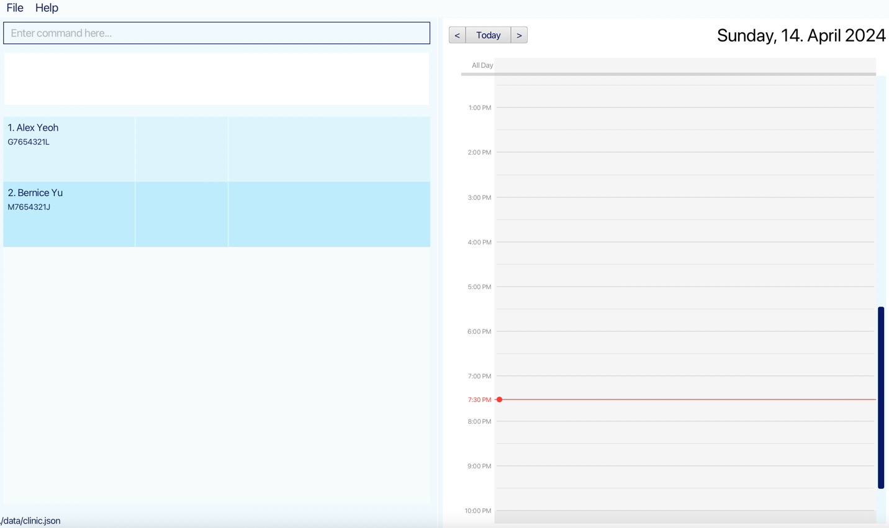
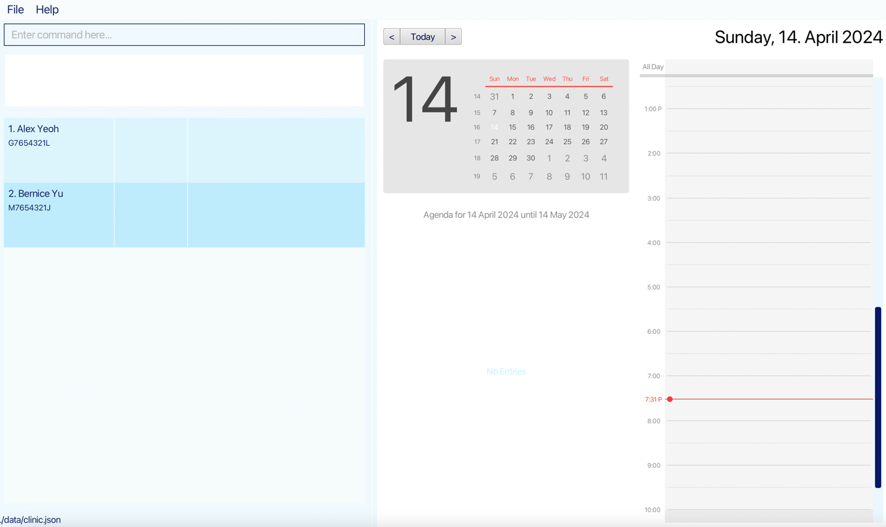
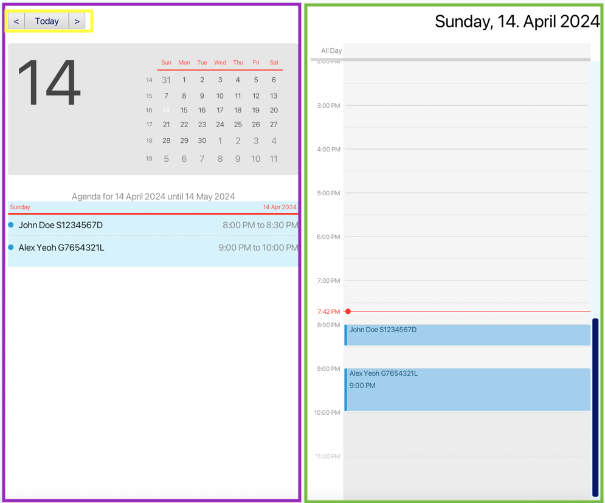
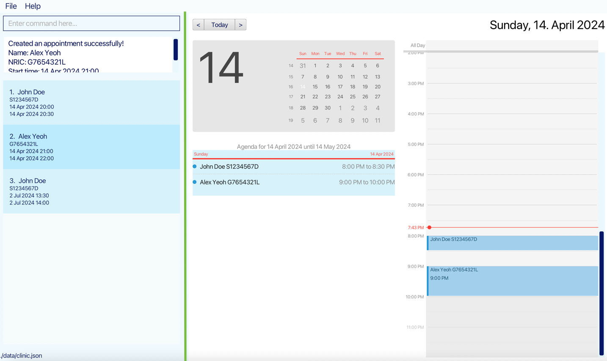

## Introduction

Welcome to **VitalConnect**, your all-in-one desktop application for efficient clinic management, optimized for both Command Line Interface (CLI) and Graphical User Interface (GUI).

Designed to streamline your clinic management tasks, VitalConnect offers the speed of a CLI with the convenience of a GUI, allowing you to effortlessly organize your patient and appointments with just a few keystrokes.With its intuitive interface and robust features, you can add, delete, and search for appointments, track medical information, as well as check patient contact for communication with ease.

So, whether you're a busy professional juggling multiple appointments, VitalConnect is here to simplify your life. Let's dive in and explore how VitalConnect can revolutionize the way you manage your appointment and patient.

--------------------------------------------------------------------------------------------------------------------

## Quick start

For developers, you can head over to our Developer Guide [here](https://ay2324s2-cs2103t-w08-2.github.io/tp/DeveloperGuide.html) for the technical details.

For first time users, you can first go through the steps listed under [Installation](https://ay2324s2-cs2103t-w08-2.github.io/tp/UserGuide.html#installation) and then check out the table of contents to experiment with whichever command that you are interested in.

--------------------------------------------------------------------------------------------------------------------

## Table of Contents

- [Introduction](#introduction)
- [Quick start](#quick-start)
- [Installation](#installation)

- [Commands](#commands)
    - [Viewing help](#viewing-help--help)
    - [Patient Management](#patient-management)
        - [Adding a patient](#adding-a-patient--add)
        - [Editing identification information](#editing-identification-information--edit)
        - [Deleting a patient](#deleting-a-patient--delete)
        - [Listing all patients](#listing-all-patients--list)
    - [Contact Management](#contact-management)
        - [Adding contact information](#adding-contact-information--addc)
        - [Editing contact information](#editing-contact-information--editc)
        - [Deleting contact information](#deleting-contact-information--deletec)
        - [Listing contact information](#listing-contact-information--listc)
    - [Medical Information Management](#medical-information-management)
        - [Adding medical information](#adding-medical-information--addm)
        - [Editing medical information](#editing-medical-information--editm)
        - [Deleting medical information](#deleting-medical-information--deletem)
        - [Listing medical information](#listing-medical-information--listm)
    - [Appointment Management](#appointment-management)
        - [Adding an appointment](#adding-an-appointment--adda)
        - [Editing an appointment](#editing-an-appointment--edita)
        - [Deleting an appointment](#deleting-an-appointment--deletea)
        - [Listing appointments](#list-out-appointments--lista)
    - [Other features](#other-features)
        - [Locating patients by name](#locating-patients-by-name--find)
        - [Locating appointments by patient](#locating-appointments-by-patient--finda)
        - [Undoing last command](#undoing-last-command--undo)
        - [Clearing all entries](#clearing-all-entries--clear)
        - [Exiting the program](#exiting-the-program--exit)
    - [Saving the data](#saving-the-data)
    - [Editing the data file](#editing-the-data-file)
- [Timetable](#timetable)
- [FAQ](#faq)
- [Known issues](#known-issues)
- [Command summary](#command-summary)

--------------------------------------------------------------------------------------------------------------------

## Installation

1. Ensure you have Java `11` or above installed in your Computer. You learn how to do so [here](https://www.java.com/en/download/help/download_options.html)

2. Download the latest `vitalconnect.jar` from [here](https://github.com/AY2324S2-CS2103T-W08-2/tp/releases).

3. Copy the file to the folder you want to use as the _home folder_ for your VitalConnect.

4. Open a command terminal or learn how to do so [here](https://www.freecodecamp.org/news/command-line-for-beginners/)

5. Type `cd` followed by the location of the folder that you are putting the `vitalconnect.jar` file in. Find out more [here](https://www.wikihow.com/Change-Directories-in-Command-Prompt)

6. Type `java -jar vitalconnect.jar` and press Enter to launch java and run the application. A GUI should appear in a few seconds. The calendar view will only be shown if the right panel is large enough. You can resize the panel by dragging the divider between the two panels. More instructions can be found in the `Timetable` section. (Note that your application might contain different initial placeholder datas.)

Type any command in the command box and press Enter to execute it. e.g. typing `help` and pressing Enter will open the help window. 
   Some example commands you can try:

    * `list` : Lists all patients.

    * `add n/John Doe ic/S1234567D` : Adds a patient named `John Doe` with nric `S1234567D` to the Clinic.

    * `delete 3` : Deletes the 3rd patient shown in the current list.

    * `clear` : Deletes all patients.

    * `exit` : Exits the app.

Refer to the [Commands](https://ay2324s2-cs2103t-w08-2.github.io/tp/UserGuide.html#commands) below for specific details for each of the commands.

[Back to table of contents](#toc)

--------------------------------------------------------------------------------------------------------------------

## Commands

**:information_source: General notes about the command format:** 

* Words in `UPPER_CASE` are the parameters to be supplied by the user. 
  e.g. in `add n/NAME ic/NRIC`, `NAME` and `NRIC` are parameters which can be used as `add n/John Doe ic/S1234567D`.

* Parameters can be in any order. 
  e.g. if the command specifies `ic/NRIC p/PHONE_NUMBER`, `p/PHONE_NUMBER ic/NRIC` is also acceptable.

* Extraneous parameters for commands that do not take in parameters (such as `help`, `list`, `exit` and `clear`) will be ignored. 
  e.g. if the command specifies `help 123`, it will be interpreted as `help`.

* If you are using a PDF version of this document, be careful when copying and pasting commands that span multiple lines as space characters surrounding line-breaks may be omitted when copied over to the application.

* Invalid prefixes may lead to unmatching error messages. For example, `editm ic/S1234567D H/8 W/2` will result in an error message saying that `NRIC is invalid...` instead of `invalid prefix`. This is because the whole part `S1234567D H/8 W/2` is treated as the NRIC.

### Viewing help : `help`

Shows a message explaning how to access the help page.

Format: `help`

[Back to table of contents](#toc)

## Patient Management
* The system follows a modular way of saving data. First create a patient using the `add` command, then use specific commands to add specific information to the patient such as contact and medical information. If there is no need for the information, there is no need to add it but the creation of a patient in the database requires using the `add` command.
* The NRIC of a patient is used to indentify the patient so patients can share names but not NRICs.
* The NRIC of a patient must be a valid NRIC. You may find more details about the structure in the wikipedia page [here](https://en.wikipedia.org/wiki/National_Registration_Identity_Card#Structure_of_the_NRIC_number/FIN) or check using this online tool [here](https://nric.biz/)

### Adding a patient : `add`

Adds a patient to the clinic using their identification information.

Format: `add ic/NRIC n/NAME`

* The NRIC **must** be a valid NRIC.
* Names should only contain alphanumeric characters and spaces, and it should not be blank.
* We currently do not support symbols or other special characters so you will need to omit them from the name.
* After adding a patient, the current displaying list will be automatically changed to the list of all patients to reflect the changes.

Examples:
* `add ic/S1234567D n/James Doe`

[Back to table of contents](#toc)

### Editing identification information : `edit`

Edits a patient's identification information.

Format: `edit ic/NRIC n/NAME`

* The NRIC must be a NRIC of an already existing patient.
* If you would like to change the NRIC instead of the name, create a new patient using `add` then use `delete` on the outdated version.

Examples:
* `edit ic/S1234567D n/John Doe`

[Back to table of contents](#toc)

### Deleting a patient : `delete`

Deletes the specified patient from the clinic.

Format: `delete INDEX`

* Deletes the patient at the specified `INDEX`.
* INDEX reference: The index corresponds to the position of a patient within the **currently displayed patient list**. This list may be:
  * All patients with non-empty contact information (result of the `listc` command).
  * All patients with non-empty medical information (result of the `listm` command).
  * All patients in the system (result of the `list` command).
* If the display is not currently showing a patient list (for example, it's showing the appointment list), then the index refers to the last patient list viewed before the switch to the appointment list.
* After successful deletion of the patient, the list shown in the panel will be updated to the one that the index refers to. It is recommended to display the list of patients (run `list`, `listc`, or `listm`) before using the `delete` command to avoid confusion.
* The index **must be a positive integer** 1, 2, 3, …​

:exclamation: **Caution:**
The deletion of a patient will result in the deletion of all the contact and medical information as well as all the appointments of the patient.   If accidentally delete a patient, can use `undo` command to recover the deleted patient. 

Examples:
* `list` followed by `delete 2` deletes the 2nd patient in the clinic.
* `find Betsy` followed by `delete 1` deletes the 1st patient in the results of the `find` command.

[Back to table of contents](#toc)

### Listing all patients : `list`

Shows a list of all patients in the clinic.

Format: `list`

[Back to table of contents](#toc)

## Contact Management

For patients that do not require the clinic to contact them in the future such as a patient looking for medication, you can ignore the contact management section as there is no need to store their contact information in the database.

:exclamation: **Caution:**
Once the contact information has been added to an existing patient, you are no longer able to add contact information using the `addc` command. Instead, you should use the `editc` command to edit the existing contact information. 

### Adding contact information : `addc`

Adds the contact information to a patient in the clinic.

Format: `addc ic/NRIC [p/PHONE_NUMBER] [e/EMAIL] [a/ADDRESS]`

**:information_source: Additional notes about the command format:** 
Items in square brackets are optional. 
  e.g `[p/91234567]`

* The NRIC must be a NRIC of an already existing patient.
* At least one of the optional fields must be provided.
* If a prefix (i.e. `p/`, `e/`, `a/`) is included in the command, the value following it should not be empty. If user does not want to add a specific field, do not include its prefix in the command. Otherwise an error message will be shown as empty values for these fields are not allowed.
* Phone numbers should only contain numeric value without any other characters, and it should be 3 to 15 digits long.
* Emails should be of the format local-part@domain and adhere to the following constraints:
    1. The local-part should only contain alphanumeric characters and these special characters, excluding the parentheses, (+_.-). The local-part may not start or end with any special characters, and the special characters should not be adjacent to each other.
    2. This is followed by a '@' and then a domain name. The domain name is made up of domain labels separated by periods.
       The domain name must:
        - end with a domain label at least 2 characters long
        - have each domain label start and end with alphanumeric characters
        - have each domain label consist of alphanumeric characters, separated only by hyphens, if any.
* Address has a max length of 50 characters, and it should not be empty upon adding. Although in particular cases, the address can be larger than the current limit, 50 characters is able to suffice the needs in most situations. For long addresses that exceeds the 50 character limit, the compromise is to use shorforms, such as b123 instead of block 123.

Examples:
* `addc ic/S1234567D p/91234567`
* `addc ic/S1234567D p/91234567 e/test@email.com `
* `addc ic/S1234567D p/91234567 e/test@email.com a/123, Clementi Rd, 1234665`

[Back to table of contents](#toc)

### Editing contact information : `editc`

Edits the contact information of a patient in the clinic. It is also used to add or delete certain field of the contact information.

Format: `editc ic/NRIC [p/PHONE_NUMBER] [e/EMAIL] [a/ADDRESS]`

**:information_source: Additional notes about the command format:** 
Items in square brackets are optional. 
  e.g `[p/91234567]`

* At least one of the `optional fields` must be provided.
* To delete an `optional field`, leave the `VALUE` part empty.
* If the `VALUE` part is not empty, the corresponding patient contact's field will either be updated or added with the new value.
* If all three fields of contact information (phone, email, and address) become empty, the contact information of the patient will be considered deleted. If one want to add a new contact information, please use `addc` command.
* Phone numbers should only contain numeric value without any other characters, and it should be 3 to 15 digits long.
* Emails should be of the format local-part@domain and adhere to the following constraints:
    1. The local-part should only contain alphanumeric characters and these special characters, excluding the parentheses, (+_.-). The local-part may not start or end with any special characters, and the special characters should not be adjacent to each other.
    2. This is followed by a '@' and then a domain name. The domain name is made up of domain labels separated by periods.
       The domain name must:
        - end with a domain label at least 2 characters long
        - have each domain label start and end with alphanumeric characters
        - have each domain label consist of alphanumeric characters, separated only by hyphens, if any.
* Address has a max length of 50 characters, and it should not be empty upon adding. Although in particular cases, the address can be larger than the current limit, 50 characters is able to suffice the needs in most situations. For long addresses that exceeds the 50 character limit, the compromise is to use shorforms, such as b123 instead of block 123.

Examples:
* `editc ic/S1234567D p/91234567` will result in the phone number of the patient with NRIC `S1234567D` being updated to `91234567`.
* `editc ic/S1234567D a/` will result in the address of the patient with NRIC `S1234567D` being deleted.

[Back to table of contents](#toc)

### Deleting contact information : `deletec`

Deletes the contact information of a patient in the clinic.

Format: `deletec ic/NRIC`

Examples:
* `deletec ic/S1234567D` will result in the deletion of the contact information of the patient with the NRIC `S1234567D`.

[Back to table of contents](#toc)

### Listing contact information : `listc`

Lists all patients with contact information.

[Back to table of contents](#toc)

## Medical Information Management

### Adding medical information : `addm`

Adds the medical information to a patient in the clinic.

Format: `addm ic/NRIC h/HEIGHT w/WEIGHT [t/ALLERGY]…​`

* The NRIC must be a NRIC of an already existing patient.
* The value HEIGHT should only contain alphanumerical measured in cm, and should be bigger than 0 and smaller than 300.
* The value WEIGHT should only contain alphanumerical measured in kg, and should be bigger than 0 and smaller than 650.
* The allergy tag should be a single word of alphanumeric characters and no space.

**:information_source: Additional notes about the command format:** 
Items in square brackets are optional. 
e.g `addm ic/S1234567D h/163 w/50`
Items with `…`​ after them can be used multiple times including zero times. 
e.g. `t/ALLERGY…​` can be used as ` ` (i.e. 0 times), `t/Amoxicillin`, `t/insulin t/iodine` etc.

Examples:
* `addm ic/S1234567D h/163 w/50`
* `addm ic/S1234567D h/163 w/50 t/insulin t/iodine`

[Back to table of contents](#toc)

### Editing medical information : `editm`

Edit the medical information of an existing patient.

Format: `editm ic/NRIC [h/HEIGHT] [w/WEIGHT] [-o] [at/ALLERGY…​]`

* At least one of the optional fields must be provided.
* The value HEIGHT should only contain alphanumerical measured in cm, and should be bigger than 0 and smaller than 300.
* The value WEIGHT should only contain alphanumerical measured in kg, and should be bigger than 0 and smaller than 650.
* The overwrite notation `-o` should only appear once.
* `-o` can be placed at any position in the command.
* All allergy tag should be a single word of alphanumeric characters and no space.

**:information_source: Additional notes about the command format:** 
Items in square brackets are optional. 
  e.g `editm ic/S1234567D h/130 w/100`

Prefix explanation:
- `w/WEIGHT`, `h/HIGHT`: Change the current wight and height value to WEIGHT and HEIGHT.
- `at/ALLERGY`: Append this tag to existing tag.
- `-o`: Set mode for this command to overwrite, meaning all existing tag will be deleted and replaced by the new tags.

Example:
* `editm ic/S1234567D w/100 -o at/milk at/egg`

This will change the weight of patient with ic S1234567D to 100 and
overwrite allergy tag to milk and egg.
* Noted that command achieving same effect could be `editm ic/S1234567D w/100 at/milk at/egg -o` or `editm ic/S1234567D -o w/100 at/milk at/egg`.

:exclamation: **Caution:**
Use of prefix `-o` will delete all existing tag, including the added tag in current command before it. 

[Back to table of contents](#toc)

### Deleting medical information : `deletem`

Deletes the medical information of a patient in the clinic.

Format: `deletem ic/NRIC`

Examples:
* `deletec ic/S1234567D` will result in the deletion of the medical information of the patient with the NRIC `S1234567D`.

[Back to table of contents](#toc)

### Listing medical information : `listm`

Lists all patients with medical information.

[Back to table of contents](#toc)

## Appointment Management

### Adding an appointment : `adda`

Adds an appointment for an exist patient to the appointment list.

Format: `adda ic/NRIC s/START_TIME d/DURATION`

__`ic/NRIC`: Patient's NRIC__
* The patient(ic) should already exist in the patient list.

__`s/START_TIME`: Start time of the appointment__
* The start time should be in the format: __DD/MM/YYYY HHmm__.
* The start time should be a valid date. (e.g. 31/02/2024 is not valid as the date is not exist)
* The start time should __not be earlier__ than now time.
* The appointment time period should not overlap with other appointments.

__`d/DURATION`: the time length of the appointment__
__The input should be the number of duration unit:__
* The time length of one unit of duration equals __15 minutes__.
* The input for duration should be a positive integer.
* The limitation of the input of duration is 96 (24 hours).

Examples:
* `adda ic/S1234567D s/02/06/2024 1300 d/2`
* This will add an appointment for the patient with NRIC `S1234567D` start from 2nd June 2024 at 1:00 PM and end at 1:30 PM.

[Back to table of contents](#toc)

### Editing an appointment : `edita`

Edits the start time and/or duration of an appointment of an existing patient.

__Format:__ `edita INDEX [s/START_TIME] [d/DURATION]`

Edit both start time and duration: `edita INDEX s/START_TIME d/DURATION`

Edit only the start time: `edita INDEX s/START_TIME`

Edit only the time duration: `edita INDEX d/DURATION`

**:information_source: Additional notes about the command format:** 
Items in square brackets are optional. 
  e.g `edita 1 s/02/02/2025 1300`

__`INDEX`: Index of the to be edited appointment in the appointment list__
* The index should not be out of range nor negative.

__`s/START_TIME`: Start time of the appointment__
* The start time should be in the format: __DD/MM/YYYY HHmm__.
* The start time should __not be earlier__ than now time.
* The start time should be a valid date. (e.g. 31/02/2024 is not valid as the date is not exist)
* The edited  appointment time period should not overlap with other appointments.

__`d/DURATION`: the time length of the appointment__

__The input should be the number of duration unit:__
* The time length of one unit of duration equals __15 minutes__.
* The input for duration should be a positive integer.
* The limitation of the input of duration is 96 (24 hours).

Examples:
* `edita 1 s/02/02/2025 1300 d/4`
    * This change the time of the appointment of index 1 to Feb 2 2025 at 1pm and end at 2pm.
* `edita 1 s/02/02/2025 1300`
    * Only change the appointment start time to Feb 2 2025 at 1pm, the time duration remains the same.
* `edita 1 d/4`
    * Only change the time length of the appointment to one hour, the start time remains the same.

[Back to table of contents](#toc)

### Deleting an appointment : `deletea`

Deletes an exist appointment from the appointment list by providing the index of the appointment in the list.

Format: `deletea INDEX`

* Deletes the appointment at the specified `INDEX`.
* The index refers to the index number stored in the appointment list, regardless of whether the appointment list is the current showing list in the list displaying panel.
* The index **must be a positive integer** 1, 2, 3, …​

Examples:
* `deletea 1`

:exclamation: **Caution:**
The appointment can be added, deleted and edited even the appointment list is not displayed.

[Back to table of contents](#toc)

### List out appointments : `lista`

List out all the appointments for the clinic.

Format: `lista`

[Back to table of contents](#toc)

## Other Features

### Locating patients by name : `find`

Finds patients whose names contain any of the given keywords.

Format: `find KEYWORD [MORE_KEYWORDS]`

* The search is case-insensitive. e.g `hans` will match `Hans`
* The order of the keywords does not matter. e.g. `Hans Bo` will match `Bo Hans`
* Only the name is searched.
* Only full words will be matched e.g. `Han` will not match `Hans`
* Patients matching at least one keyword will be returned (i.e. `OR` search).
  e.g. `Hans Bo` will return `Hans Gruber`, `Bo Yang`

Examples:
* `find John` returns `John Doe` and `John Bard`

[Back to table of contents](#toc)

### Locating appointments by patient : `finda`

Find and list out all the appointment of a specific patient in the appointment list.

Format: `finda ic/NRIC`

* The NRIC must be a NRIC of an already existing patient.

Examples:
* `finda ic/S1234567D`

[Back to table of contents](#toc)

### Undoing last command : `undo`

Undoing the last command made.

Format: `undo`

* Commands such as `list` will not be considered as a command to undo and will undo the command before it if possible.
* If the user adds a patient and then use the `list` command. Undo will undo the addition of the patient.

[Back to table of contents](#toc)

### Clearing all entries : `clear`

Clears all entries from the clinic.

Format: `clear`

:exclamation: **Caution:**
This command will delete all the patients from the clinic. 

[Back to table of contents](#toc)

### Exiting the program : `exit`

Exits the program.

Format: `exit`

[Back to table of contents](#toc)

### Saving the data

Clinic data are saved in the hard disk automatically after any command that changes the data. There is no need to save manually. All of the data is saved automatically as JSON files `[JAR file location]/data/clinic.json` and `[JAR file location]/data/appointments.json`. The data is saved into two JSON files, one for patient data and one for appointment data.

:exclamation: **Caution:**
If you exit the program through other means, your data will still be saved. If you are transfering data, be mindful that there are two JSON files with data.

[Back to table of contents](#toc)

### Editing the data file

Advanced users are welcome to update data directly by editing the following JSON files, `[JAR file location]/data/clinic.json` or `[JAR file location]/data/appointments.json`.

:exclamation: **Caution:**
Incorrect or certain edits can cause the Clinic to behave in unexpected ways (e.g., if a value entered is outside of the acceptable range). Therefore, edit the data file only if you are confident that you can update it correctly.

[Back to table of contents](#toc)

--------------------------------------------------------------------------------------------------------------------
## Timetable

This feature allows the user to visualise the appointment throughout the day.

The right part of the timetable (marked by green box) is a visual representation of the appointment for today. Each appointment is represented by a blue box with patient's name and nric. If the box is large enough, it will also display the appointment's start time. The height of the box represents the time length of the appointment.

The left part of the timetable (marked by purple box) is a calendar view with agendas for the current day. The complete information for the apopintment can be found in the agenda view, including the patient's name, nric, and the start time and end time of the appointments.

The three buttons on the top left of the timetable (marked by yellow box) allows user to adjust which day to look at using mouse.
1. `Today` button will show the timetable of the current day.
2. `<` button will show the timetable of the previous day.
3. `>` button will show the timetable of the next day.

The timetable also support changing the view using keyboard shortcuts.
1. `Ctrl + P` will show the timetable of the previous day.
2. `Ctrl + N` will show the timetable of the next day.
3. `Ctrl + T` will show the timetable of the today.

It is worth noting that the left calendar view (marked by purple box in the above image) is only shown when the left panel size is large enough (i.e. larger than 700 pixels). If the calendar is not currently showing, users can resize the panel by dragging the divider in the middle of the application. The divider is highlighted in **green color** in the following two images below.

After dragging the divider to the left, the calendar view will be shown.

[Back to table of contents](#toc)

--------------------------------------------------------------------------------------------------------------------
## FAQ

**Q**: How do I transfer my data to another Computer? 
**A**: Install the app in the other computer and overwrite the empty data file it creates with the file that contains the data of your previous Clinic home folder.

[Back to table of contents](#toc)

--------------------------------------------------------------------------------------------------------------------

## Known issues

1. **When using multiple screens**, if you move the application to a secondary screen, and later switch to using only the primary screen, the GUI will open off-screen. The remedy is to delete the `preferences.json` file created by the application before running the application again.

[Back to table of contents](#toc)

--------------------------------------------------------------------------------------------------------------------

[Back to table of contents](#toc)

## Command summary

| Action      | Format, Examples                                                                                                                             |
|-------------|----------------------------------------------------------------------------------------------------------------------------------------------|
| **Help**    | `help`                                                                                                                                       |
| **Add**     | `add ic/NRIC n/NAME`   e.g., `add ic/S1234567D n/James Doe`                                                                               |
| **Edit**    | `edit ic/NRIC n/NAME`   e.g., `add ic/S1234567D n/John Doe`                                                                               |
| **Delete**  | `delete INDEX`   e.g., `delete 3`                                                                                                         |
| **List**    | `list`                                                                                                                                       |
| **Addc**    | `addc ic/NRIC [p/PHONE_NUMBER] [e/EMAIL] [a/ADDRESS]`   e.g., `addc ic/S1234567D p/91234567 e/test@email.com a/123, Clementi Rd, 1234665` |
| **Editc**   | `editc ic/NRIC [p/PHONE_NUMBER] [e/EMAIL] [a/ADDRESS]`   e.g., `editc ic/S1234567D p/91234567 e/testing@email.com a/Blk 123 Street 4`     |
| **Deletec** | `deletec ic/NRIC`   e.g., `deletec ic/S1234567D`                                                                                          |
| **Addm**    | `addm ic/NRIC h/HEIGHT w/WEIGHT [t/ALLERGY]…​`   e.g., `addm ic/S1234567D h/163 w/50 t/insulin t/iodine`                                  |
| **Editm**   | `editm ic/NRIC h/HEIGHT w/WEIGHT [t/ALLERGY]…`   e.g., `editm ic/S1234567D h/165 w/55 t/aspirin`                                          |
| **Deletem** | `deletem ic/NRIC`   e.g., `deletem ic/S1234567D`                                                                                          |
| **Listm**   | `listm`                                                                                                                                      |
| **Adda**    | `adda ic/NRIC s/DD/MM/YYYY HHMM d/DURATION`   e.g., `adda ic/S1234567D s/02/02/2024 1300 d/4`                                             |
| **Edita**   | `edita INDEX s/DD/MM/YYYY HHMM d/DURATION`   e.g., `edita 1 s/02/02/2024 1400 d/4`                                                        |
| **Deletea** | `deletea INDEX`   e.g., `deletea 1`                                                                                                       |
| **Lista**   | `lista`                                                                                                                                      |
| **Find**    | `find KEYWORD [MORE_KEYWORDS]`  e.g., `find John Doe`                                                                                     |
| **Finda**   | `finda ic/NRIC`  e.g., `finda ic/S1234567D`                                                                                               |
| **Undo**    | `undo`                                                                                                                                       |
| **Clear**   | `clear`                                                                                                                                      |
| **Exit**    | `exit`                                                                                                                                       |

[Back to table of contents](#toc)
