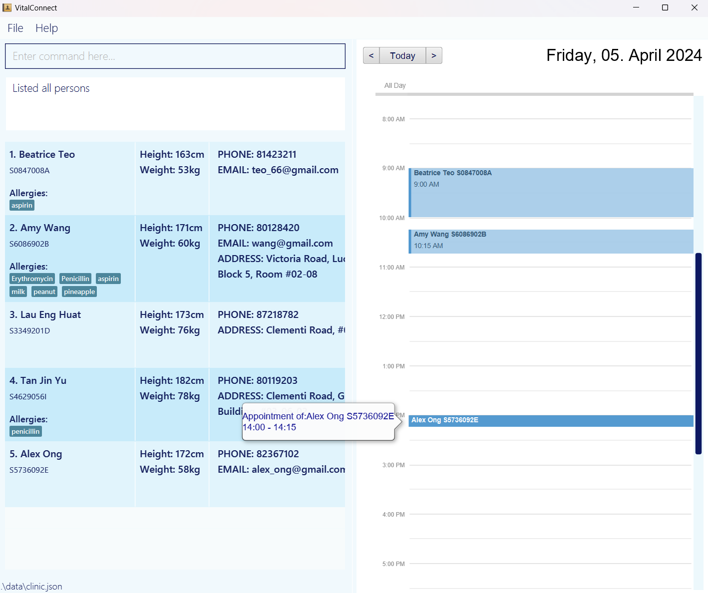

Welcome to **vitalConnect**, your all-in-one desktop application for efficient clinic management, optimized for both Command Line Interface (CLI) and Graphical User Interface (GUI). Designed to streamline your clinic management tasks, VitalConnect offers the speed of a CLI with the convenience of a GUI, allowing you to effortlessly organize your patient and appointments with just a few keystrokes.

If you are relatively good at typing, having the benefit of CLI of reducing time of dragging your mouse around, vitalConnect empowers you to manage your appointments swiftly and effectively. With its intuitive interface and robust features, you can add, delete, and search for appointments, track medical information, as well as check patient contact for communication with ease.

If you're a busy professional juggling multiple appointments, vitalConnect is here to simplify your life. Let's dive in and explore how vitalConnect can revolutionize the way you manage your appointment and patient.

* If you are interested in using vitalConnect, head over to the [_Quick Start_ section of the **User Guide**](UserGuide.html#quick-start).
* If you are interested about developing vitalConnect, please go check out our [**Developer Guide**](DeveloperGuide.html) and make contributions.

**Acknowledgements**

* Libraries used: [JavaFX](https://openjfx.io/), [Jackson](https://github.com/FasterXML/jackson), [JUnit5](https://github.com/junit-team/junit5), [CalendarFX](https://github.com/dlsc-software-consulting-gmbh/CalendarFX)
